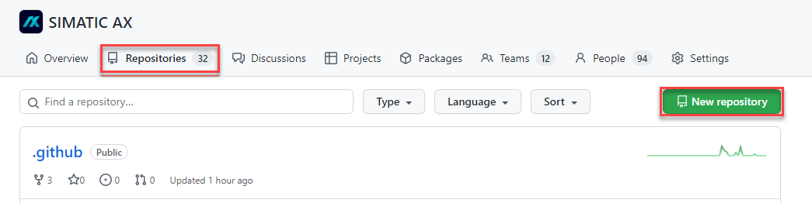
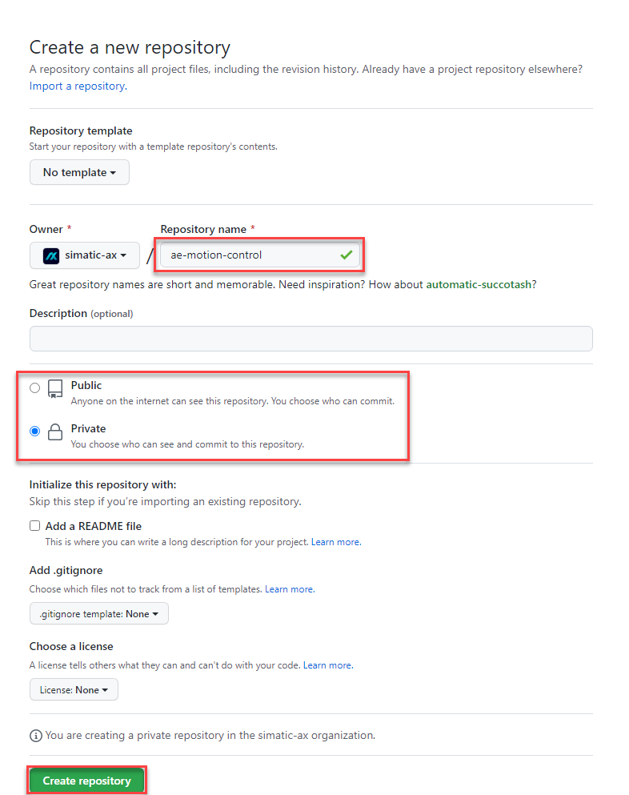
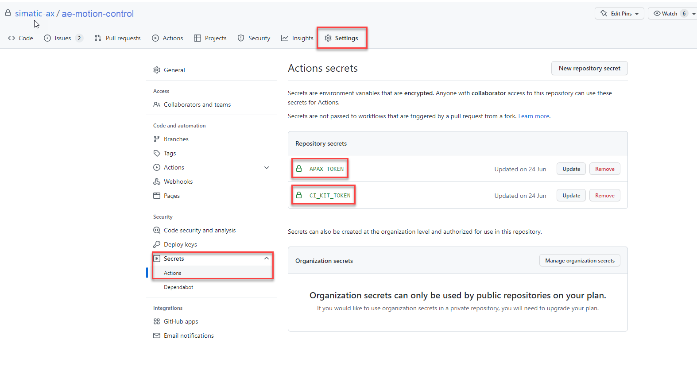
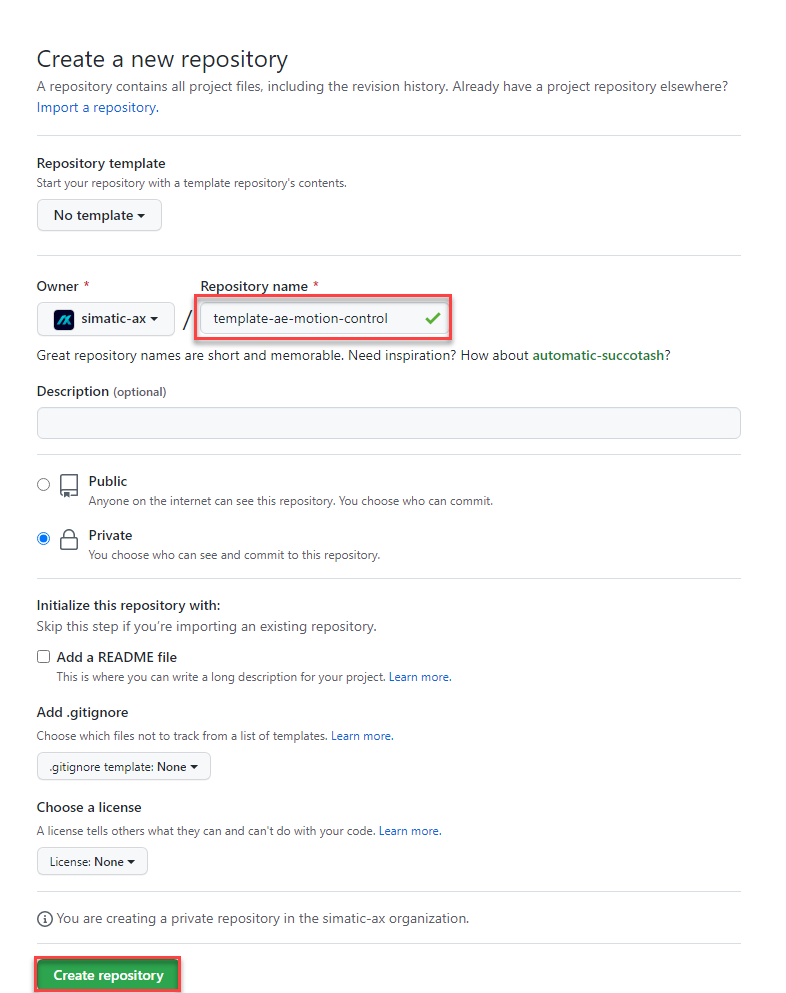
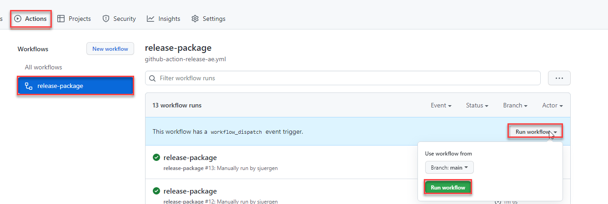

# Template for `Application Examples`

## What is an application example

An application example ist a stand alone project, which demonstrates the usage of one ore more features or libraries. This template is optimized for a creation of application examples for PLC applications (executable on a PLCSIM Advanced or real PLC S7-1500).

## Create a project from this template

Example: If you want to create an application example `ae-motion-control` then use this template by entering:

```bash
apax create @simatic-ax/app --registry https://npm.pkg.github.com ae-motion-control
```

## Create an application example on GitHub

Example: An application example `ae-motion-control` should be created.

1. Create a repository `ae-motion-control` on GitHub

    

    

    > If public or private depends is an internal decision

1. Add the secrets to the repository (only in the case if it's private)

    

   > you don't know the secrets? Ask one of the owners or `@sjuergen`

1. Create a repository `template-ae-motion-control` on GitHub which contains the apax package

    

    

    > If public or private depends is an internal decision

1. If not done, login to the GitHub registry

    ```bash
    apax login --registry https://npm.pkg.github.com/ --password <your personal access token>
    ```

    More information you'll find [here](https://github.com/simatic-ax/.sharedstuff/blob/main/doc/personalaccesstoken.md)

1. Create the application example from the template

    ```bash
    apax create @simatic-ax/app --registry https://npm.pkg.github.com ae-motion-control
    ```

1. Add the remote repository to your local repository

    ```bash
    git remote add origin git@github.com:simatic-ax/ae-motion-control.git
    git push -u origin main
    ```

1. Install dependencies

      ```bash
      apax install -L
      ```

1. Optionally update dependencies

      ```bash
      apax update -a
      ```

1. Now you can implement the application example

## Release the application example

### Before releasing

Before you release the application example, all checks have to be done:

- [ ] OSS Clearing
- [ ] Patent Clearing
- [ ] ECC (Export control with the [ecc wizzard](https://code-ops.code.siemens.io/ecc-wizard/))
- [ ] License is up to date
- [ ] The readme contains a description:
  - What is this application doing?
  - How to install the application example
  - How to start the application example
- [ ] Application example has been reviewed

### Release of the application example



## Structure of this template

```bash
app
 |
 +- .github
 |      +- github-action-release-ae.yml
 |
 +- docs
 |    |
 |    +- app.md
 |
 +- src
 |   +- Configuration.st
 |   +- MainProgram.st
 |
 +- test
 |    +- dummy.st
 |
 +- watchlist
 |    +- default.mon
 |
 +- .gitignore
 +- apax.yml
 +- LICENSE.md
 +- README.md
```

## Learn More

See the [documentation on custom templates](https://axciteme.siemens.com/docs/apax/templates).
