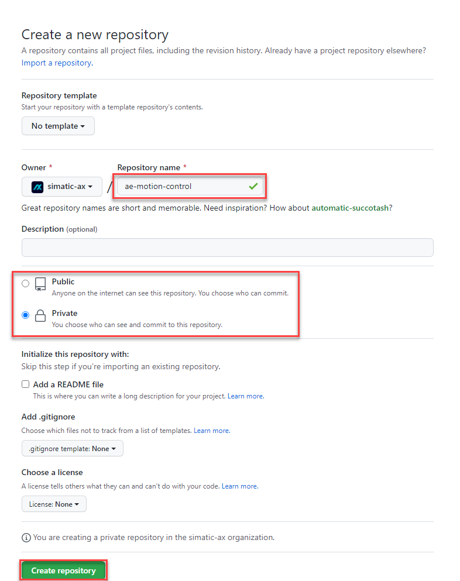
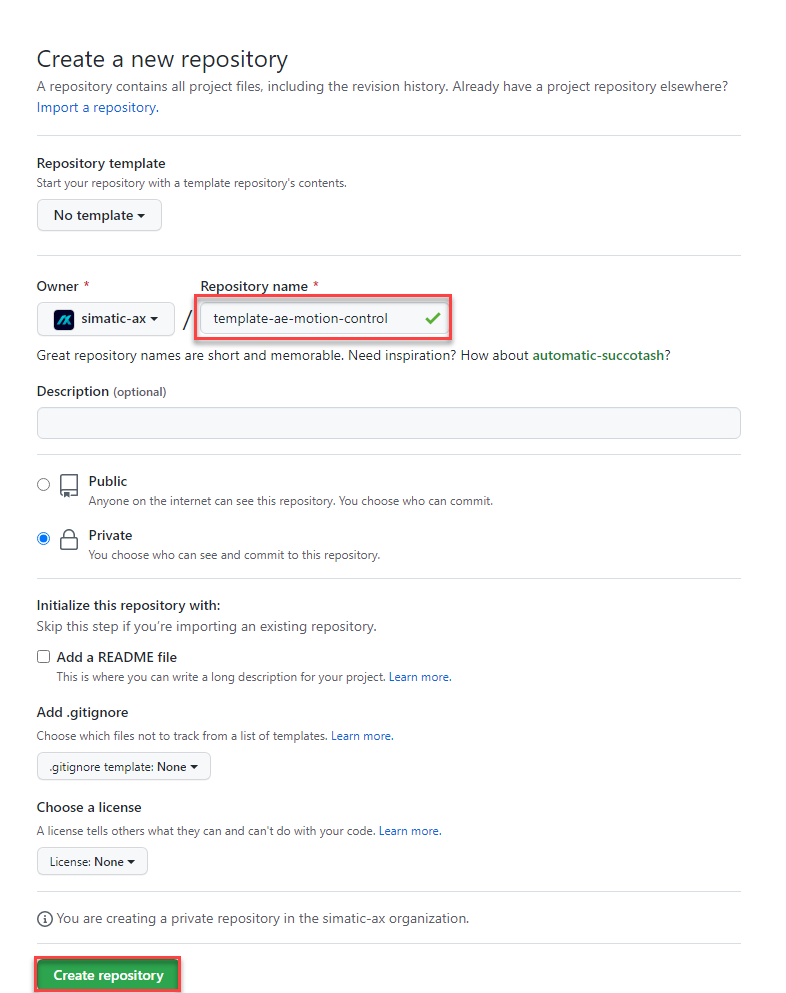
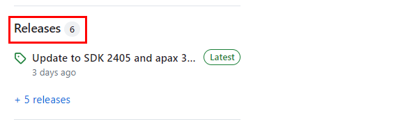
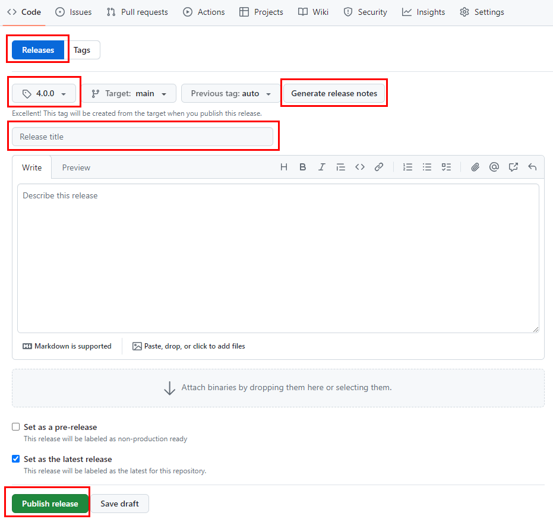

# Template for `Application Examples` on GitHub

## What is an application example

An application example is a standalone project, which demonstrates the usage of one ore more features or libraries. This template is optimized for the creation of application examples of PLC applications (executable on a PLCSIM Advanced or real PLC S7-1500).

## Create a project from this "apax-template"

If you want to create a new Github application example in this community please start with using this apax-template by entering the following in the terminal :

```bash
apax create @simatic-ax/app --registry https://npm.pkg.github.com
```

## Folder-structure of this "app" apax-template

```bash
app
 |
 +- .github
 |      | # default GitHub workflows any gh-community-scope app-repo should have (ignore)
 |      +- lint-repo.yml
 |      +- release-applicationexample.yml
 |
 +- docs
 |    | # the place for additional user-documentation
 |    +- app.md
 |
 +- src
 |   | # adjust and add user-programs here
 |   +- Configuration.st
 |   +- MainProgram.st
 |
 +- test
 |   | # adjust and add test-programs here
 |    +- dummy.st
 |
 +- watchlist
 |   | # adjust and add your watchlists here
 |    +- default.mon
 |
 | # additional meta-information for GitHub/-workflows (ignore)
 +- .gitattributes
 +- .gitignore
 +- .markdownlint.yml
 +- apax-files-section.yml
 | # adjust the project description file / add apax-scripts
 +- apax.yml
 | # settings file for activate of renovate
 +- renovate.json
 | # essential git project files, pls. adjust
 +- CODEOWNERS
 +- README.md
 +- LICENSE.md
```

## Create an `application example` repository with this apax-template on GitHub

Step-by-step instructions: for creating & releasing `ae-motion-control` (case example)

1. Create a repository `ae-motion-control` on GitHub

   This repository is tailored to be in sync with your local git-repository which holds on to your actual application program.

   Purpose: Later people can create local clones/ forks from the repository and all its files.

   

   

   - For the actual "Repository name" always start with `ae- ...`
   - As "Description" please start with `Application example:...`.
   - If "public" or "private" depends on internal decisions.

2. Add the secrets to the repository (only in the case if it's private)

   

   > You don't know the secrets? Ask one of the owners or `@sjuergen`

3. Create an additional repository `template-ae-motion-control` on GitHub

   Unlike the base repository, this "template-..." variant is just there for holding on to the application example apax package, which will be created automatically after a successful "release"-process on GitHub (release-pipeline with GitHub "workflows"). There is no need for you to further maintain this repository after the creation.

   Purpose: Later people can use apax to "create" new projects based on that application project apax package (template functionality).

   

   

   - For the actual "Repository name" always start with `template-ae- ...`.
   - As "Description" please use the following scheme: `Template "ae-<your-app-name>" / dummy-repo`.
   - If "public" or "private" depends on internal decisions.
   - Add at least a "README.md" and a "LICENSE.md" file

4. Initiate your local repository

   Once this is done the remote core-repository on GitHub is ready to receive the application program from your local Git repository.

   Therefore follow the steps below on your local system by navigating to your desired project directory. Open the terminal.

5. If not done yet, login to the GitHub registry first

   ```bash
   apax login --registry https://npm.pkg.github.com/
   ```

   Follow the instruction and type in your credentials.

   More information you'll find [here](https://github.com/simatic-ax/.github/blob/main/docs/personalaccesstoken.md)

6. Create a new project based on the GitHub app apax-template

   After a successful login you can follow-up with entering:

   ```bash
   apax create @simatic-ax/app --registry https://npm.pkg.github.com ae-motion-control
   ```

   Here: the application example will be named "ae-motion-control" and the project-folder now is predefined with the templates contents.

7. Connect the previous created remote GitHub repository to your local Git repository

   A apax "create" command will always initiate a local Git repository. This one must be synced with the "simatic-ax/ae-motion-control" GitHub repository now.

   ```bash
   git remote add origin git@github.com:simatic-ax/ae-motion-control.git
   ```

   ```bash
   git push -u origin main
   ```

8. Install the project dependencies

   ```bash
   apax install
   ```

9. Optionally update its dependencies

   ```bash
   apax update
   ```

10. Now you can implement the application example

    Open the project-folder with AX-Code and start adjusting the files to fit your application example. Consider using Git branches and frequent commits in order to keep track of your changes.
    Don't forget to sync your local changes with the git-remote repository on GitHub at some point.

## Release the application example

### Before releasing

Before you release the application example, all checks have to be done:

- [ ] OSS Clearing
- [ ] Patent Clearing
- [ ] ECC (Export control with the [ecc wizzard](https://code-ops.code.siemens.io/ecc-wizard/))
- [ ] License is up to date
- [ ] Codeowner are up to date
- [ ] The Readme.md contains a description:
  - What is this application doing?
  - How to install the application example
  - How to start the application example
- [ ] Application example has been reviewed
  - Create an MergeRequest for your Main-branch and add community-admins as reviewer

### Release of the application example

Successfully releasing your application example will automatically trigger the creation of an apax-package template of your current application-example within the "template-..." Github repository. Depending on the used workflows the base repository may have to succeed linter and other checks in order to do so. Be aware of failing pipelines (GitHub workflows).

Draft a new "Release"-tag within your base GitHub repository

- choose an appropriate version tag
- choose an appropriate release-title
- let github generate release-notes
- publish release





> This action may only can be performed by one of the community-admins.

## Congratulations 🐱‍🏍

You finally contributed to the simatic-ax community offering apax-packages for everyone by simply using apax.

KEEP GOING 🐱‍💻!

> BE AWARE: Only successful GitHub workflows (pipelines) will create the package at our GitHub package-registry (scope: @simatic-ax).

## Learn More

See the [documentation on custom templates](https://console.simatic-ax.siemens.io/docs/apax/templates).
